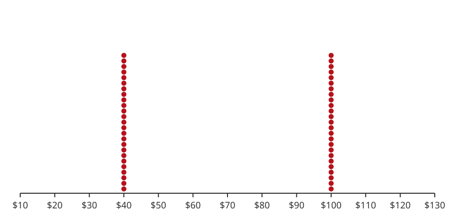
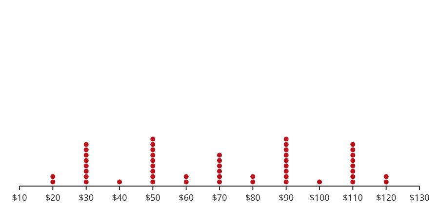
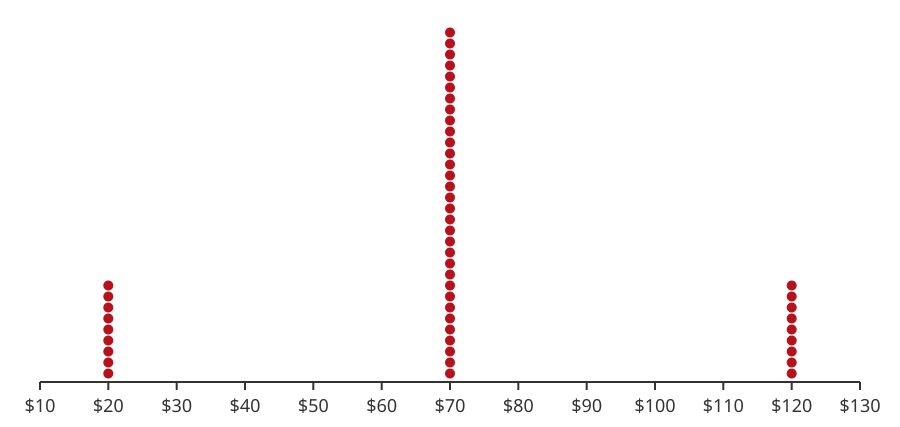

---
format:
  html: default
  pdf:
    geometry:
      - margin=0.7in
    fontsize: 10pt
---

# ATM Withdrawals at Three Machines

A bank wants to monitor the ATM withdrawals its customers make at three locations. The bank samples 50 withdrawals from each machine. For each machine, the table shows how many of the 50 withdrawals were for each amount, with the dotplot below it. The data is also in [ATMWithdrawals.csv](data/ATMWithdrawals.csv), one column per machine, so you can open it in Google Sheets.

a) Is each dotplot distribution symmetric? (the same on the left and the right)

b) Calculate the mean and the standard deviation of each machine's withdrawals.

c) Are the dotplot distributions of withdrawal amounts the same for all three machines?

d) True or false? "There are many different dotplot distributions with the same mean and standard deviation." Explain using your answers above.

### Machine 1

| Amount | \$20 | \$30 | \$40 | \$50 | \$60 | \$70 | \$80 | \$90 | \$100 | \$110 | \$120 |
|:----------|----:|----:|----:|----:|----:|----:|----:|----:|-----:|-----:|-----:|
| Count | 0 | 0 | 25 | 0 | 0 | 0 | 0 | 0 | 25 | 0 | 0 |

{width=65%}

### Machine 2

| Amount | \$20 | \$30 | \$40 | \$50 | \$60 | \$70 | \$80 | \$90 | \$100 | \$110 | \$120 |
|:----------|----:|----:|----:|----:|----:|----:|----:|----:|-----:|-----:|-----:|
| Count | 2 | 8 | 1 | 9 | 2 | 6 | 2 | 9 | 1 | 8 | 2 |

{width=65%}

### Machine 3

| Amount | \$20 | \$30 | \$40 | \$50 | \$60 | \$70 | \$80 | \$90 | \$100 | \$110 | \$120 |
|:----------|----:|----:|----:|----:|----:|----:|----:|----:|-----:|-----:|-----:|
| Count | 9 | 0 | 0 | 0 | 0 | 32 | 0 | 0 | 0 | 0 | 9 |

{width=65%}
