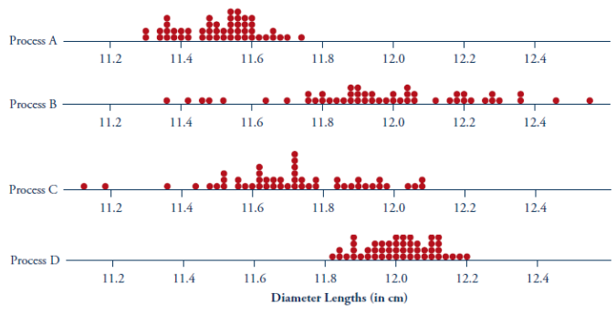

---
format:
  html: default
  pdf:
    geometry:
      - margin=0.7in
    fontsize: 10pt
---

# Comparing Processes: Rod Diameters

A process attempts to make rods with diameters of 12 cm, but the actual diameters vary slightly from rod to rod. Rods with diameters within 0.2 cm of the target value (between 11.8 and 12.2 cm) are considered to be within specifications (acceptable). Suppose that 50 rods are collected for inspection from each of four processes. Dotplots of their diameters are shown below.

{width=90%}

a) Which process is best? (Overall closest to the target most often)

b) Which process is most stable? (Overall most clustered together)

c) Which process is least stable? (Overall most scattered)

d) Which process is generally farthest from the target? (Overall farthest away most often)
