## Dotplots

A **dotplot** shows each data value as a dot above a number line. Repeated values stack up.

Dotplots are simple and easy to read. With a very large data set they can get cluttered.

The overall shape of the data is called its **distribution**.

## Dotplot Examples

```{=html}
<div style="display: grid; grid-template-columns: 1fr 1fr; gap: 10px 30px;">
  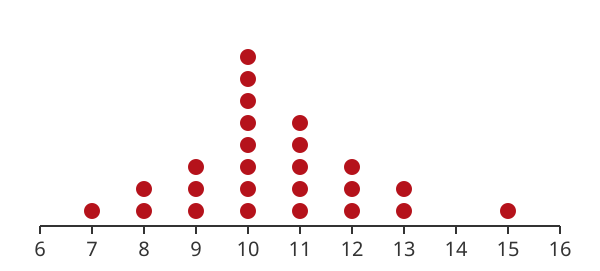
  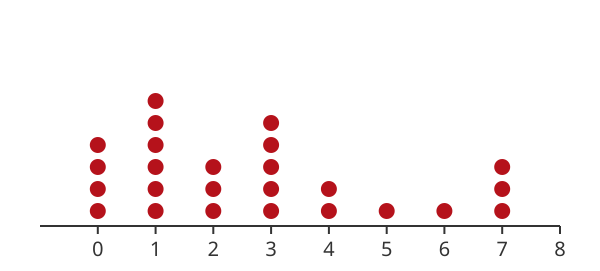
  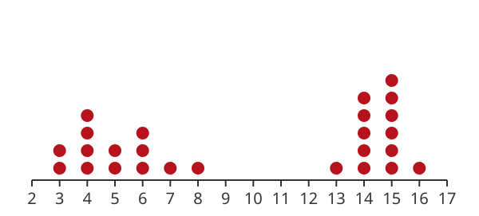
  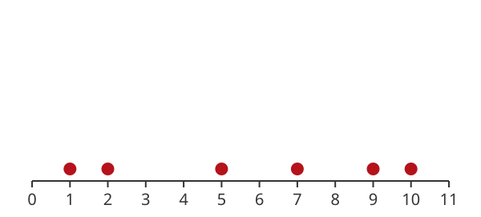
</div>
```

## Tallying the Data for Dotplots

$$
3,\ 6,\ 1,\ 3,\ 4,\ 6,\ 3,\ 1,\ 7,\ 3,\ 6,\ 1,\ 3,\ 6,\ 3
$$

Go through the data one value at a time and make a **tally mark** for each one. Every fifth mark crosses out the four before it.

The number of marks for a data value is the height of its stack of dots. A data value with no marks has no dots.

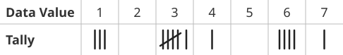

## 1. A Simple Dotplot

Make a dotplot of this data:

$$
6,\ 8,\ 8,\ 9,\ 5,\ 6,\ 8
$$

## 1. A Simple Dotplot

Make a dotplot of this data:

$$
6,\ 8,\ 8,\ 9,\ 5,\ 6,\ 8
$$

Make a tally of the values. How many times does each value occur?

How tall is each stack?

## 1. A Simple Dotplot

$$
6,\ 8,\ 8,\ 9,\ 5,\ 6,\ 8
$$

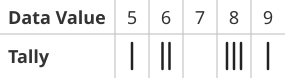

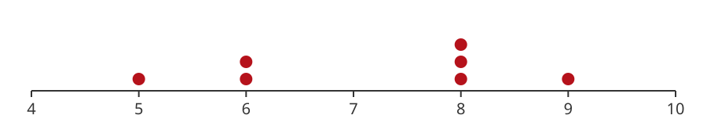

One 5, two 6s, three 8s, and one 9.

## Describing a Distribution

Three important things to look for:

- **Peaks:** Are there any high points? How many?
- **Spread:** How spread out is the data? Are there clusters?
- **Outliers:** Are there values far from the rest?

## 2. Peaks

Make a dotplot of this data:

$$
\begin{aligned}
&7,\ 11,\ 5,\ 7,\ 12,\ 12,\ 4,\ 14,\ 4,\ 13, \\
&9,\ 12,\ 3,\ 4,\ 2,\ 13,\ 10,\ 12,\ 3,\ 4
\end{aligned}
$$

## 2. Peaks

Make a dotplot of this data:

$$
\begin{aligned}
&7,\ 11,\ 5,\ 7,\ 12,\ 12,\ 4,\ 14,\ 4,\ 13, \\
&9,\ 12,\ 3,\ 4,\ 2,\ 13,\ 10,\ 12,\ 3,\ 4
\end{aligned}
$$

Are there any peaks? Where?

## 2. Peaks

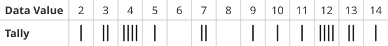

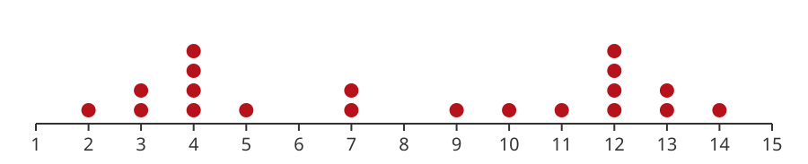

The data has **two peaks**, one at 4 and one at 12.

## 3. No Peaks

Make a dotplot of this data:

$$
12,\ 29,\ 18,\ 14,\ 22,\ 28,\ 5,\ 24,\ 6,\ 10
$$

## 3. No Peaks

Make a dotplot of this data:

$$
12,\ 29,\ 18,\ 14,\ 22,\ 28,\ 5,\ 24,\ 6,\ 10
$$

Are there any peaks? Where?

## 3. No Peaks

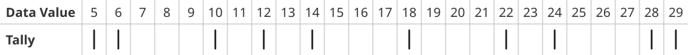

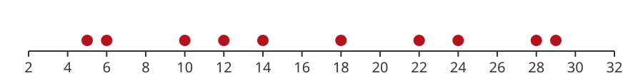

The data has **no peaks**. Every value occurs once.

## Peaks vs Clusters

A **peak** is a high point in the distribution: a tall stack of dots.

A **cluster** is a group of values that are close together along the number line.

You can have clusters without peaks.

## Spread and Range

One way to describe the spread is the **range**: from the minimum value to the maximum value.

## 4. Range

Make a dotplot of this data:

$$
\begin{aligned}
&30,\ 29,\ 22,\ 26,\ 32,\ 32,\ 23,\ 28, \\
&20,\ 28,\ 37,\ 35,\ 29,\ 36,\ 34
\end{aligned}
$$

## 4. Range

Make a dotplot of this data:

$$
\begin{aligned}
&30,\ 29,\ 22,\ 26,\ 32,\ 32,\ 23,\ 28, \\
&20,\ 28,\ 37,\ 35,\ 29,\ 36,\ 34
\end{aligned}
$$

What is the smallest value? What is the largest?

## 4. Range

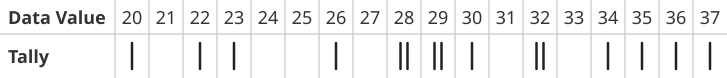

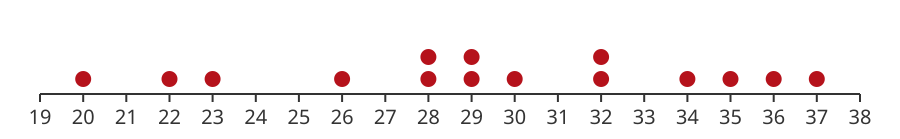

The range of this data is **from 20 to 37**.

## 5. Clusters

Make a dotplot of this data:

$$
3,\ 12,\ 11,\ 13,\ 14,\ 25,\ 26,\ 27,\ 45,\ 46,\ 44,\ 52
$$

## 5. Clusters

Make a dotplot of this data:

$$
3,\ 12,\ 11,\ 13,\ 14,\ 25,\ 26,\ 27,\ 45,\ 46,\ 44,\ 52
$$

What is the range? Are there any clusters?

## 5. Clusters

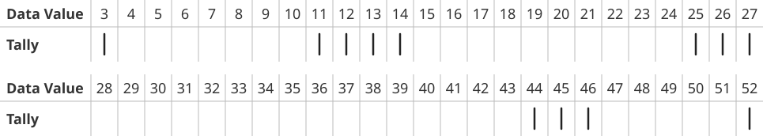

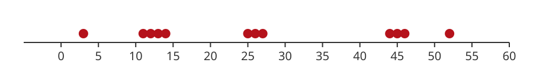

The range is from 3 to 52. The data is in **three clusters**: around 13, around 26, and around 45.

The range alone does not tell the whole story.

## Outliers

An **outlier** is a value that is far from the rest of the data and does not look typical.

Sometimes an outlier is an error in collecting the data. Sometimes it is just an unusual value that really happened.

## 6. Monthly Demand

Here is the demand for a product for each of the last 36 months:

$$
\begin{aligned}
&38,\ 46,\ 58,\ 36,\ 44,\ 46,\ 51,\ 43,\ 61,\ 44,\ 48,\ 53, \\
&42,\ 37,\ 59,\ 27,\ 52,\ 45,\ 53,\ 48,\ 62,\ 35,\ 58,\ 61, \\
&45,\ 25,\ 49,\ 40,\ 51,\ 47,\ 51,\ 48,\ 54,\ 43,\ 39,\ 40
\end{aligned}
$$

## 6. Monthly Demand

Here is the demand for a product for each of the last 36 months:

$$
\begin{aligned}
&38,\ 46,\ 58,\ 36,\ 44,\ 46,\ 51,\ 43,\ 61,\ 44,\ 48,\ 53, \\
&42,\ 37,\ 59,\ 27,\ 52,\ 45,\ 53,\ 48,\ 62,\ 35,\ 58,\ 61, \\
&45,\ 25,\ 49,\ 40,\ 51,\ 47,\ 51,\ 48,\ 54,\ 43,\ 39,\ 40
\end{aligned}
$$

Were there months with very low or very high demand? Are there any outliers?

## 6. Monthly Demand

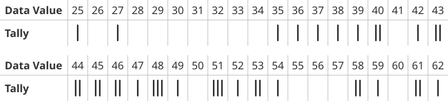

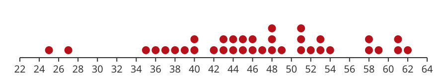

Most months the demand was between about 35 and 54. There are **two outliers at 25 and 27**. What happened in those months?

There is also a small cluster of high values around 58 to 62.
