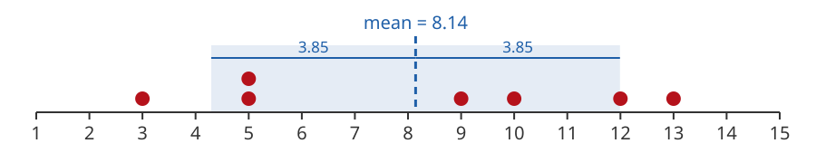

## Measures of Spread

The mean, median and mode describe the "center" of a set of data values.

They do not tell us how **spread out** the data is. Is the data huddled together near the middle, or spread across a wide range?

This is called the data's **variability**. We will look at two ways to describe it:

- **Range**
- **Standard Deviation**

## Range

The **range** is the largest value minus the smallest value.

$$
\text{range} = \max - \min
$$

We already used the range when we looked at dotplots.

## 1. Range of a Sample

Find the range of this sample:

$$
10,\ 6,\ 5,\ 14,\ 6,\ 12
$$

## 1. Range of a Sample

Find the range of this sample:

$$
10,\ 6,\ 5,\ 14,\ 6,\ 12
$$

What is the largest value? What is the smallest value?

What is the range?

## 1. Range of a Sample

Find the range of this sample:

$$
10,\ 6,\ 5,\ \mathbf{14},\ 6,\ 12
$$

The largest value is 14 and the smallest is 5.

$$
\text{range} = \max - \min = 14 - 5 = 9
$$

## Standard Deviation

The **standard deviation** is the measure of spread we use most often.

It describes spread as the **"average distance away"** from the mean: roughly how far a typical data value is from the center.

## Standard Deviation Formulas

For a **population**:

$$
\sigma = \sqrt{\frac{\sum (x-\mu)^2}{N}}
$$

$\mu$ is the population mean and $N$ is the population size.

For a **sample**:

$$
s = \sqrt{\frac{\sum (x-\bar{x})^2}{n-1}}
$$

$\bar{x}$ is the sample mean and $n$ is the sample size. Notice we divide by $n-1$, not $n$.

## Use a Spreadsheet

We will **never** use the formula by hand.

We always compute the standard deviation with a spreadsheet:

| Measure | Spreadsheet function |
|:--|:--|
| Mean | `=AVERAGE(range)` |
| Sample standard deviation | `=STDEV(range)` |

## 2. Standard Deviation in a Spreadsheet

Find the mean and the sample standard deviation of this sample ($n = 7$):

$$
5,\ 12,\ 13,\ 5,\ 3,\ 9,\ 10
$$

## 2. Standard Deviation in a Spreadsheet

Enter the data in a column, then use `AVERAGE` and `STDEV`:

|   | A | B | C |
|:-:|:--|:--|:--|
| **1** | data |  |  |
| **2** | 5 | mean | `=AVERAGE(A2:A8)` |
| **3** | 12 | std dev | `=STDEV(A2:A8)` |
| **4** | 13 |  |  |
| **5** | 5 |  |  |
| **6** | 3 |  |  |
| **7** | 9 |  |  |
| **8** | 10 |  |  |

## 2. Standard Deviation in a Spreadsheet

Here is the result:

|   | A | B | C |
|:-:|:--|:--|:--|
| **1** | data |  |  |
| **2** | 5 | mean | 8.14 |
| **3** | 12 | std dev | 3.85 |
| **4** | 13 |  |  |
| **5** | 5 |  |  |
| **6** | 3 |  |  |
| **7** | 9 |  |  |
| **8** | 10 |  |  |

## Interpreting Standard Deviation

$$
\bar{x} = 8.14 \qquad s = 3.85
$$

On average, a typical data value is about **3.85** units from the mean **8.14**.

